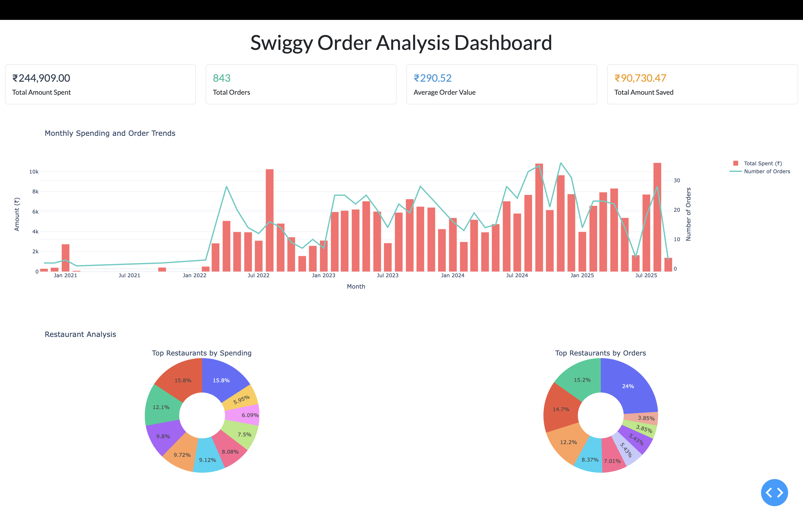
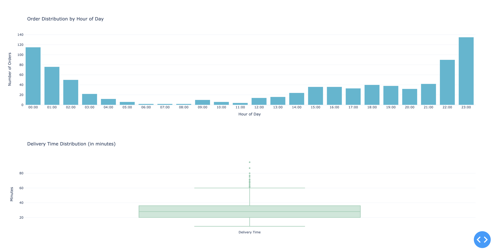

# Swiggy Order Analysis

A Python application that analyzes your Swiggy order history by extracting data from Gmail and visualizing it in an interactive dashboard.

## Features
- Extracts order details from Swiggy delivery confirmation emails
- Analyzes spending patterns, restaurant preferences, and delivery times
- Interactive visualizations using Plotly and Dash
- Clean, modern dashboard interface

## Dashboard Screenshots

### Summary Statistics and Monthly Trends

*Summary statistics showing total spend, orders, and monthly trends*

### Restaurant Analysis and Time Patterns

*Detailed analysis of restaurant preferences and ordering patterns*

## Setup

### 1. Gmail API Setup
1. Go to [Google Cloud Console](https://console.cloud.google.com/)
2. Create a new project
3. Enable the Gmail API for your project:
   - Go to "APIs & Services" → "Library"
   - Search for "Gmail API"
   - Click "Enable" 

4. Configure OAuth consent screen:
   - Go to "APIs & Services" → "OAuth consent screen"
   - Fill in the application name and user support email
   - Choose "External" user type
   - Add your email as a developer contact
   - Save and continue

5. Create OAuth 2.0 credentials:
   - Go "Create client" → "OAuth client ID"
   - Choose "Desktop app" as application type
   - Give it a name (e.g., "Swiggy Analysis")
   - Click "Create"
   - Download the credentials JSON file
   - Rename it to `credentials.json` and place it in the `auth/` directory
   - Go to "Audience" → "Test users" 
   - Under "Add user", add your email address 

Note: Since this is in "Testing" mode, only added test users can access the application. This is fine for personal use. For public distribution, the app would need to be verified by Google.

### 2. Python Environment Setup
```bash
# Create and activate conda environment
conda create -n swiggy_analysis python=3.10
conda activate swiggy_analysis

# Install required packages
pip install -r requirements.txt
```

### 3. Running the Application

1. First, extract data from emails:
```bash
cd src
python data_pipeline.py
```
This will:
- Authenticate with Gmail (browser window will open for authorization)
- Search for Swiggy delivery emails
- Parse order details
- Save to CSV

2. Run the dashboard:
```bash
python dashboard.py
```
Open http://localhost:8050 in your browser to view the dashboard.

## Project Structure
```
swiggy_analysis/
├── auth/                    # Authentication files
│   └── credentials.json     # Place your Gmail API credentials here
├── src/
│   ├── config.py           # Configuration settings
│   ├── data_pipeline.py    # Email extraction pipeline
│   ├── dashboard.py        # Visualization dashboard
│   ├── email_text_parser.py # Email parsing logic
│   └── gmail_client.py     # Gmail API client
├── assets/
│   └── images/             # Dashboard screenshots
├── .env.example            # Environment variables template
├── .gitignore             # Git ignore rules
├── README.md              # Project documentation
└── requirements.txt       # Python dependencies
```

## Features

### 1. Data Extraction
- Fetches emails from Gmail using Gmail API
- Parses Swiggy delivery confirmation emails
- Extracts key information:
  - Restaurant name
  - Order time
  - Delivery time
  - Order amount
  - Discount amount

### 2. Interactive Dashboard
- Summary statistics:
  - Total amount spent
  - Number of orders
  - Average order value
  - Total savings from discounts
- Monthly trends:
  - Spending patterns
  - Order frequency
- Restaurant analysis:
  - Top restaurants by spending
  - Top restaurants by order count
- Time patterns:
  - Order distribution by hour
  - Delivery time analysis

## Data Privacy
- The application only reads emails from Swiggy (noreply@swiggy.in)
- No email content is stored, only order details
- Credentials are stored locally
- Token is saved in auth/token.json for reuse

## Contributing
Feel free to open issues or submit pull requests for improvements!